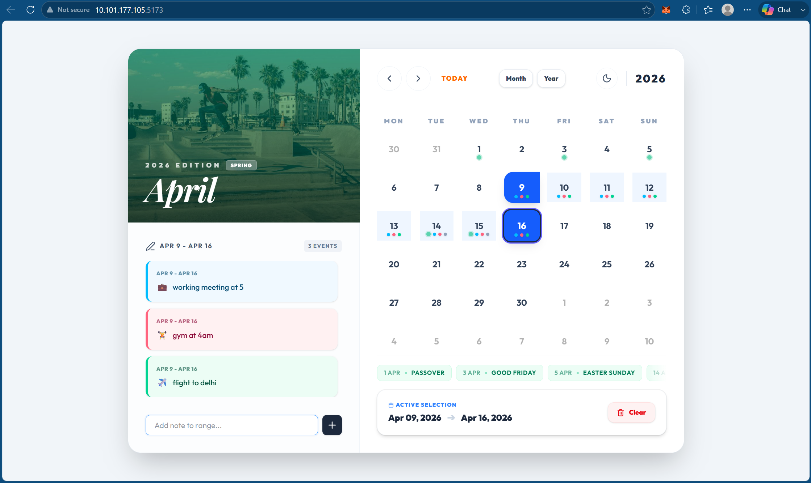

# Enhanced Interactive Calendar Component



Welcome to the **Premium Interactive Calendar Component**! This project was engineered from the ground up to address the Frontend Engineering Challenge by transforming a basic static UI reference into a highly responsive, aesthetically sophisticated, and heavily interactive modern web application.

## 🌟 Elite Features & Engineering

This application heavily departs from a standard MVP block calendar by implementing Senior-level UX choices and advanced React-state logic matrices:

### 1. Semantic NLP Note Contexts
A built-in Regex mapping engine (`CONTEXT_EMOJIS`) automatically parses string queries inside your notes. If you type *"Flight to NYC"* or *"Dentist Appointment"*, the logic natively extracts the sentiment and securely injects the corresponding contextual emoji (✈️, 🏥, 🍔, 💻) directly into your UI!

### 2. Physical Keyboard Grid Mapping (A11y)
The grid architecture maps a `tabIndex={0}` structural listener tied to `date-fns` algebraic temporal shifts. You can traverse the entire 42-day calendar matrix spatially using your physical `<Up>`, `<Down>`, `<Left>`, and `<Right>` arrow keys. Focus is highlighted via a kinetic purple outline ring, and you can map an active date array purely by hitting `<Space>`.

### 3. Kinetic "Glassmorphic" Menu Selectors
The Month and Year navigators step away from traditional padding borders. They utilize an incredibly premium translucent design architecture featuring:
- Massive, geometric background data watermarks mapping abbreviated year codes (e.g. `26` for `2026`).
- Responsive numerical scale manipulators on hover states for satisfying product feedback.
- Clean glowing `Active` micro-indicators.

### 4. Advanced Fluid Layouts & Swipable Overflows
To lock the application to a gorgeous single-viewport frame without breaking on mobile, massive datasets (like October Holidays) are shifted into native horizontal `hide-scrollbar` tracking lists with gradient fades. The entire header layout intelligently collapses into a functional dual-tier flex-block on 375px screens automatically!

---

## 🛠️ Built With Modern Specs

- **React 18**: Deeply state-driven functional hooks layout (`useEffect` mapped `localStorage`).
- **Date-Fns**: Complex temporal math calculation engine without reinventing the logical wheel.
- **Tailwind CSS v4**: Utilized for extremely rapid logic layout matrices and dynamic string compilation configurations.
- **Lucide Icons**: Minimalist SVG iconography.

## 🚀 How to Run Locally

1. Clone this repository to your local machine.
2. Navigate into the directory and install dependencies:
   ```bash
   npm install
   ```
3. Boot up the local proxy development node:
   ```bash
   npm run dev -- --host
   ```
4. Access the beautiful functional build at `http://localhost:5173`!
